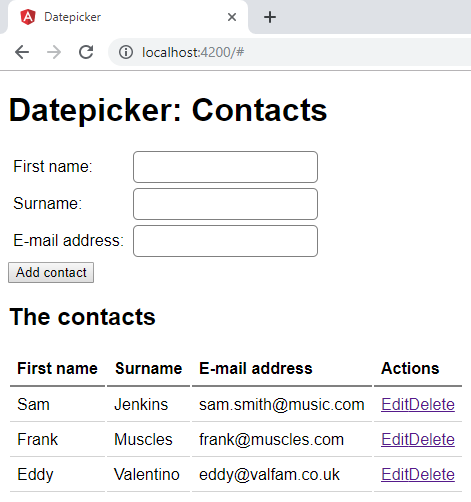

# Lab: Getting started



## Exercise 1: create the project

1. Install git from  http://git-scm.com/. When asked about "Adjusting your PATH environment", select "Run Git from the Windows Command Prompt".
1. Install Node.js from http://nodejs.org/.
1. Run these commands in the directory you want to create your project:
```bash
# install the angular command line interface
npm install --global @angular/cli

# generate new project and go to newly created directory
ng new datepicker
cd datepicker

# launches a web server and automatically refreshes when code changes
ng serve
```

## Exercise 2: Hello world

Using your favorite IDE (we like [Visual Studio Code](https://code.visualstudio.com/)), replace the existing content of the main view by a simple databinding expression that prints out "Hello world" on the page. You can find this view in `src/app/app.component.html`

```html
<div class="jumbotron">Hello {{name}}</div>
```

Open `app.component.ts`

This component has been implemented as an example, but we won't be needing any functionality provided.
Replace the whole content of the file with:

```ts
import { Component } from '@angular/core';

@Component({
  selector: 'app-root',
  templateUrl: 'app.component.html',
  styleUrls: ['app.component.css']
})
export class AppComponent {
  name: string;
  constructor() {
    this.name = 'world!';
  }
}

```

Save the documents, switch to the browser and verify that it displays "Hello world!".

Congratulations! You've taken advantage of the components within Angular to databind a simple value of the screen. Now we really can start building our Datepicker application.

## Exercise 3: Adding contacts

In this exercise, we add the basic functionality to manage our contacts.

In `app/`, create a folder `models` with a new TypeScript file called `contact.ts` inside it. Add 3 properties of type string to the interface.
```ts
export interface Contact {
	firstName: string;
	surname: string;
	email: string;
}

```

Open `AppComponent` and expose a few simple contacts.
First we will need to import the class by writing the import at the top of the TypeScript file.
```ts
import { Contact } from './models/contact';
```
And create a list of contacts:

```ts
export class AppComponent {
	contacts: Contact[] = [
		{ firstName: 'Sam', surname: 'Smith', email: 'sam.smith@music.com' },
		{ firstName: 'Frank', surname: 'Muscles', email: 'frank@muscles.com' },
		{ firstName: 'Eddy', surname: 'Valentino', email: 'eddy@valfam.co.uk' }
	];
}
```

Open `app.component.html`. Use `*ngFor` to loop over the contacts and display them in a table and add a button for editing and deleting the contact.


```html
<table class="table">
  <tr>
    <th>Name</th>
    <th>E-mail address</th>
    <th></th>
  </tr>
  <tr *ngFor="let contact of contacts">
    <td>{{contact.firstName}} {{contact.surname}}</td>
    <td>{{contact.email}}</td>
    <td>
      <button class="btn">Edit</button>
      <button class="btn btn-danger">Delete</button>
    </td>
  </tr>
</table>
```

To add a contact, we need to add a form. Create a form that can be used to create a new contact.

```html
<form (ngSubmit)="addContact()">
  <label for="inputFirstName">First name:</label>
  <input type="text" [(ngModel)]="newContact.firstName" name="firstName" id="inputFirstName" class="form-control">
  <label for="inputSurname">Surname:</label>
  <input type="text" [(ngModel)]="newContact.surname" name="surname" id="inputSurname" class="form-control">
  <label for="inputEmail">E-mail address:</label>
  <input type="text" [(ngModel)]="newContact.email" name="email" id="inputEmail" class="form-control">
  <button class="btn btn-primary">Add</button>
</form>
```

To use the `ngModel` directive, you will need to import the forms module. Open `app.module.ts` and import the module: 
```ts
import { FormsModule } from '@angular/forms';
```
and add it to the imports:
```ts
  imports: [
    BrowserModule, FormsModule
  ],
```

You will notice errors in the console (F12). That is because `newContact` doesn't exist. Angular can't read a property `firstName` of something `undefined`.
To fix this, initialize the `newContact` in the `AppComponent`.

```ts
export class AppComponent {
  contacts: Contact[] = [ /* ... */ ];
  newContact = {} as Contact;
```

Now go ahead and finish the `addContact` function in the `AppComponent`.

Verify that your table now gets appended with contacts when submitting the form.

## If time permits...

1. Implement the functionality for the "Delete" button. You'll need JavaScript's `splice()` functions to accomplish this.
1. Implement the functionality for the "Edit" button. There are multiple approaches to accomplish this, the simplest one is to simply include input fields inside every table cell with the contact. Using `*ngIf` or `*ngSwitch`, display or hide input fields depending on whether a contact is in "edit mode". Tip: add a property to every contact that tracks whether the contact is being edited.