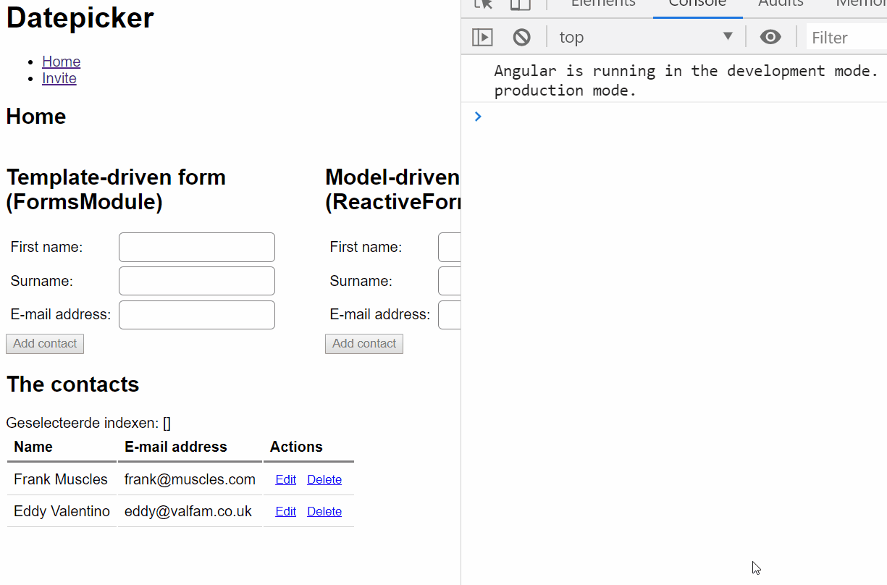

# Lab: Routing

In this lab, we'll be creating a second page where we can invite people to some sort of fun event. First we will need to set up routing, then we can fill in the page with the invitation form.



## Exercise 1: Set up routing

In this exercise, we'll make the `AppComponent` responsible for being the container where all the views are loaded into. All of its content (the contact form and list) will be moved to a new `HomePage`.

1. In `src/app`, copy `app.component.ts` and name the file `home.page.ts`. Inside the file, name the component `HomePage`, set the `templateUrl` property to `home.page.html` and remove the `selector` and `styleUrls` properties.
1. In `src/app`, create a new file `home.page.html`. Place the content from `app.component.html` inside this file, leaving `app.component.html` empty.
1. In `app.component.html`, define a `<router-outlet></router-outlet>` element where views will be dynamically inserted.
1. Declare the `HomePage` as part of your module inside of `app.module.ts`:
	```ts
	import { HomePage } from './home.page';
	
	// ...
	
	@NgModule({
		declarations: [...,	HomePage],
		imports: [...],
		providers: [...],
		bootstrap: [...]
	})
	export class AppModule { }
	```

1. Time to define routes. Create an `app.routes.ts` and define the first route.
	```ts
	import { Route } from '@angular/router';
	import { HomePage } from './home.page';

	export const routes: Route[] = [
		{ path: 'home', component: HomePage }
	];
	```
1. Activate routing by going go to `app.module.ts` and using the `RouterModule` with the defined routes.
	```ts
	import { RouterModule } from '@angular/router';
	import { HomePage } from './home.page';
	import { routes } from './app.routes';

	// ...

	@NgModule({
		declarations: [..., HomePage],
		imports: [..., RouterModule.forRoot(routes)],
		providers: [...],
		bootstrap: [...]
	})
	export class AppModule { }
	``` 

If you add `/home` to your browser's address bar, our application should now work as it did before! With the added benefit that we can now start adding more pages.

## Exercise 2: The invitation page

In this exercise, we will be creating an invitation page. Here we can:

* Describe what we'll be celebrating (the event).
* Enter three possible dates to host the event.
* Select who we want to invite.

These steps should largely resemble the steps of the previous exercises.

1. In `src/app/`, create an `InvitePage` by creating a `.ts` and `.html` file. 
1. In the `.ts` file, define a class with `@Component()` applied. Again, you don't need to supply a `selector` for this component.
1. In the HTML, enter some arbitrary text for the time being. Let's get the page working first.
1. Declare the component as part of the module.
1. In `app.routes.ts`, add a `/invite` route to this component.
1. In `app.component.html`, it might be nice to include some hyperlinks to the two pages:

	```html
	<nav>
		<ul>
			<li><a routerLink="/home">Home</a></li>
			<li><a routerLink="/invite">Invite</a></li>
		</ul>
	</nav>
	```

Your page should now be working. Now you can fill in the rest. On your invite page, create a form with input fields for the event, the possible dates and the people to invite to your fun party. When pressing the submit button, simply doing a `console.log()` of all the form values is enough.

Some hints:
* For selecting the contacts, you'll probably use something like checkboxes that have to be generated depending on the number of contacts. If you're using model-driven forms, you'll have to use `formArrayName` and `formGroupName`: https://scotch.io/tutorials/how-to-build-nested-model-driven-forms-in-angular-2

## Exercise 3: Authentication (if time permits)

