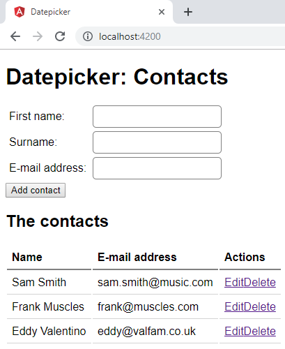

# Lab: Pipes



## Exercise 1: A contact name pipe

Let's create a simple pipe that neatly displays the name of a contact.

1. In `app/`, create a new folder `pipes` with a new file called `contact-name.pipe.ts`.
1. Within `app/pipes/contact-name.pipe.ts`, create and export a new class called `ContactNamePipe`.
1. Implement the interface `PipeTransform`. You can import this interface from `@angular/core`. Remove the second `args` parameter as we won't be using it.
1. Let's make use of TypeScript types and import `Contact` from `../models/contact` as well. Change the type of the input to `Contact` and change the name of the parameter to `contact`.
1. Implement the transform function. Return a string that appends the surname after the firstName:
    ```ts
    transform(contact: Contact): any {
        return `${contact.firstName} ${contact.surname}`;
    }
    ```

1. Add the `@Pipe({})` annotation and give your pipe a name (I suggest 'contactName').

1. Now go to `app.component.html` and use the pipe. In the table, instead of manually databinding the first name and surname, databind the contact object with our pipe.
1. If you run this in the browers, you will notice errors in the console `The pipe 'contactName' could not be found`. This is because the pipe was never registered in the `AppModule`.

    Open up the `AppModule` in `src/app/app.module.ts` and add it:

    ```ts
    import { ContactNamePipe } from './pipes/contact-name.pipe';

    @NgModule({
      imports: [...],
      declarations: [..., ContactNamePipe], // things that are part of this module
      exports: [...]
    })
    export class AppModule {
      ...
    }
    ```

Verify that the table contains the names as before. One big difference is that we can now use our pipe throughout our entire web application to ensure that this piece of information is displayed consistently.