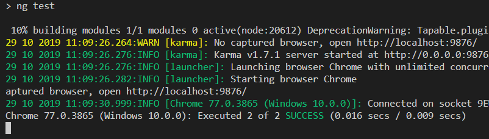

# Lab: Unit testing



Before we start, please delete the file `src/app/app.component.spec.ts`. This file contains unittests that are now failing because we changed the contents of the `AppComponent`.

## Exercise 1: test the `ContactNamePipe`.

In this exercise, we would like to unittest our `ContactNamePipe`. To do this, let's start by running Karma:

```bash
ng test
```

Chrome will be used to execute the unittests.

Now create a unittest:

1. In `src/app/pipes/`, create a new file called `contact-name.pipe.spec.ts`
1. Add the skeleton: a `describe()`, `beforeEach()` and `it()`
    ```ts
    describe('Pipe: ContactName', () => {
        beforeEach(() => {

        });
    
        it('should concatenate a contact name', () => {

        });
    });
    ```
1. In the `beforeEach()`, create a new instance of `ContactNamePipe` and store this in a variable that can be used inside the `it()` function.
1. Our `ContactNamePipe` has only one function, `transform()`. Call this function within `it()`.
1. Define an expectation (`expect()`) of what the output should be depending on the input.

If all went well, your tests should now be succeeding.

Now write a couple more tests. What if data needs to be retrieved asynchronously and your `ContactNamePipe` receives `undefined` as input?