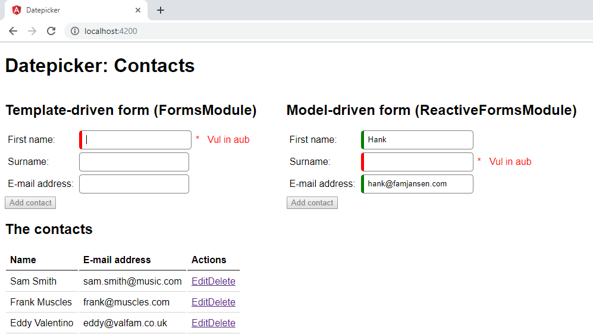

# Lab: Forms



Before doing anything, we need to make sure the form features of Angular are activated.

In `src/app/app.module.ts`, make sure the `FormsModule` is imported:

```ts
import { FormsModule } from '@angular/forms';

@NgModule({
    imports: [..., FormsModule],
    declarations: [...],
    exports: [...],
    providers: [...]
})
export class AppModule { }
```

This `FormsModule` contains the `ngModel` attribute and with this module, Angular actually performs form validation.

## Exercise 1: Styling 

1. In `src/styles.css`, add some CSS to give your form fields some color based on their state
   ```css
   .ng-valid {
		/* some coloring here */
   }
   .ng-invalid {
		/* some coloring here */
   }
   ``` 
1. In `app.component.html`, add validation to your form. `required`, `pattern`, `maxlength` and/or `minlength`

1. Your form now immediately shows these stylings as soon as the page is loaded. Play around with CSS classes `.ng-touched`, `.ng-untouched`, `.ng-pristine` and `.ng-dirty` to refine this behavior.

## Exercise 2: Disable the button on invalid

1. Add a template reference variable on your form
	```html
	<form (ngSubmit)="addContact()" #addContactForm="ngForm">
	```
1. Bind the `disabled` property to `addContactForm.valid`
	```html
	<button class="btn btn-primary" 
	        [disabled]="!addContactForm.valid">Add</button>
	```
	You might need to tweak your CSS to visibly reflect that the button has actually been disabled.

## Exercise 3: Validation messages

1. In `app.component.html`, place an `ngModel` with a template reference variable on the input fields to make the metadata accessible.
	```html
	 <input type="text" 
	        required
			pattern=".+@.+\.nl"
			name="email" 
			id="inputEmail" 
			class="form-control"
			[(ngModel)]="newContact.email"
			#email="ngModel">
	```
1. Create multiple `div`s with an `*ngIf` on it that checks whether a certain validation rule has been violated.
	```html
	<div *ngIf="email.errors?.required">Please enter your e-mail address</div>
	``` 

## Exercise 4: Model-driven approach

We will now try the model-driven approach. At the end of this exercise, our form should work just as it does now.

1. In `src/app/app.module.ts`, replace the `FormsModule` by the `ReactiveFormsModule`:

	```ts
	import { ReactiveFormsModule } from '@angular/forms';

	@NgModule({
	    imports: [..., ReactiveFormsModule],
	    declarations: [...],
	    exports: [...],
	    providers: [...]
	})
	export class AppModule { }
	```

1. In `src/app/app.component.html`, bring the form back to its basics by removing all Angular forms attributes (`ngModel` and template reference variables) as well as the validation attributes (`required`, `pattern`, etc).

1. In `app.component.ts`, import the form types
	```ts
	import { FormGroup, FormControl, Validators } from '@angular/forms';
	```
1. Add a field representing the form and build it up:
	```ts
	export class AppComponent {
		addContactForm = new FormGroup({
			// all fields
			email: new FormControl('', Validators.pattern('^.+@.+\.nl$'))
		});
	```
1. In `src/app/app.component.html`, add a `[formGroup]` reference to the `FormGroup`:

	```html
	<form (ngSubmit)="addContact()" [formGroup]="addContactForm">
	```

1. And register the different controls:

	```html
	<input type="email" formControlName="email">
	```

1. To retrieve the values posted in the form, use `.value` on the `FormGroup`:

	```ts
	addContact() {
		console.log('Submitted value:', this.addContactForm.value);
	}
	```

## Challenge! A custom validator

You can create your own validators. Your challenge: Create a `emailValidator` validator.

```ts
this.addContactForm = this.fb.group({
	// all fields
	email: ['', emailValidator]
});
```