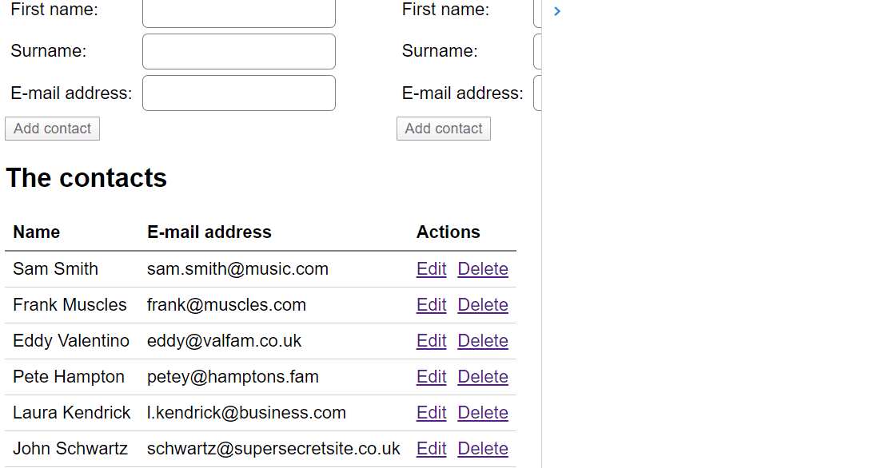

# Lab: Directives

For spectacular reasons, we want to offer our users the ability to select column cells in a table. Once done selecting, the cell values will be copied to the clipboard.



Our directive will consist of three functions:
1. Registering the user has pressed the mouse button on a table cell
1. Marking cells included in the selection when the user is moving the mouse
1. When the user releases the mouse button, getting all the column cells and copying their values

On to building our directive.
1. Add a new folder `directives` along with a new file `copy-column.directive.ts`.
1. Add the skeleton for the directive: a class and the three functions described above.

	```ts
	export class CopyColumnDirective {
		mousedown(e) {

		}

		mousemove(e) {

		}

		mouseup(e) {

		}
	}
	```
1. Add the decorator `@Directive()` to let Angular know how this class fits into its architecture with a selector to select appropriate elements. The HTML for our table will result in `<table copyColumn>`, so our selector should reflect this.

	```ts
	@Directive({ selector: '[copyColumn]' })
	export class CopyColumnDirective {
		// ...
	}
	```
1. Seeing as we know what our selector is, add the selector to the table of contacts.
	```html
	<table copyColumn>
	...
	</table>
	```
1. Add decorators to the three functions to respond to the different mouse events. Don't forget to get mouse event information by passing along `$event`.

	```ts
	@Directive({ selector: '[copyColumn]' })
	export class CopyColumnDirective {
		@HostListener('mousedown', ['$event'])
		mousedown(e) {

		}

		// ...
	}
	```
1. Because our `td` contains `div`s, we'll need to travel up the DOM tree to find the actual `td` element. Add this function:

	```ts
	private findTdInHierarchy(element: HTMLElement) {
		if (!element.parentElement) {
			return null;
		}
		if (element.tagName === 'TD') {
			return element;
		}
		return this.findTdInHierarchy(element.parentElement);
	}
	```
   
1. Now, in `mousedown()`, we're ready to note that selection has started and which `td` is the starting element.
	```ts
	@HostListener('mousedown', ['$event'])
	mousedown(e) {
		let td = this.findTdInHierarchy(e.target);
		if (td !== null) {
			this.selecting = true;
			this.startTd = td;
		}
	}
	```
1. In `mousemove()`, we're going to mark the `td`'s involved in the selection. This will offer a more user-friendly experience.

	```ts
	@HostListener('mousemove', ['$event'])
	mousemove(e) {
		let td = this.findTdInHierarchy(e.target);
		if (this.selecting && td !== null) {
			// mark tds as being part of selection
			td.classList.add('in-selection');
		}
	}
	```
1. `mouseup()` is where the real magic happens. 

	1. Start by stopping the selection and note the final element. Also add a couple of helper variables to other elements up the DOM tree.

		```ts
		@HostListener('mouseup', ['$event'])
		mouseup(e) {
			this.selecting = false;

			let endTd = this.findTdInHierarchy(e.target);
			if (endTd !== null) {
				let tbody = endTd.closest('tbody');
				let startRow = this.startTd.parentElement;
				let endRow = endTd.parentElement;

				// more to come
			}
		}
		```
	1. Remove the CSS classes for user-friendliness `in-selection` and `copied`.

		```ts
		tbody
			.querySelectorAll('td')
			.forEach(td => td.classList.remove('copied', 'in-selection'));
		```
	1. Next up, determine the row indexes and slice the relevant rows. Note that `.querySelectorAll()` returns a `NodeList` and not an array. We're converting this because an array has fancy functions like `findIndex()`.
		```ts
		let trs = [...tbody.querySelectorAll('tr')];
		let startRowIndex = trs.findIndex(row => row === startRow);
		let endRowIndex = trs.findIndex(row => row === endRow);

		let relevantTrs = trs.slice(startRowIndex, endRowIndex + 1);
		```
	1. Get the column index of `td` in order to get all of the relevant `td`s.
		```ts
		let columnIndex = [...endRow.children].findIndex(column => column === endTd);
		let tds = relevantTrs.map(tr => tr.children[columnIndex]);
		```
	1. Mark selected tds as copied
		```ts
		tds.forEach(td => td.classList.add('copied'));
		```
	1. Go through tds and get the texts to copy
		```ts
		let values = tds.map(x => x.innerText).join(', ');
		navigator.clipboard.writeText(values).then(() => {
			console.log('copied items:', values);
		});
		```
1. Add the thing to a module.